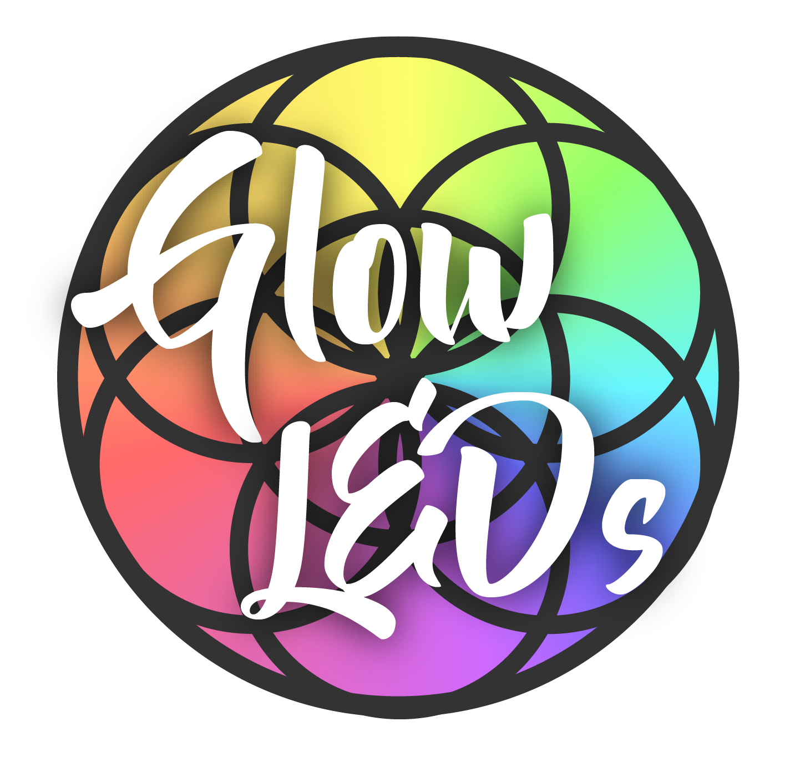

<p align="center">
  
  <h1 style="text-align: center;">A comprehensive e-commerce platform for managing payments, orders, inventory and everything in between</h1>
</p>

# About

Glow LEDs is a leader in the LED Gloving community, and is the go-to place for all things Gloving. We are a passionate team who are dedicated to providing the best possible products and experience for our users.

# Tech Stack

## Frontend

- React 18
- Vite
- Redux Toolkit
- Material-UI (MUI) v6
- React Router v6
- Socket.io Client
- Axios
- SASS
- Vitest for unit testing

## Backend

- Node.js
- Express.js
- MongoDB with Mongoose
- Socket.io
- JWT Authentication
- Nodemailer
- Stripe Integration
- EasyPost API Integration
- Various security middlewares

# Features

## User Features

- User authentication (signup, login, password reset)
- Product browsing and searching
- Shopping cart management
- Secure checkout with Stripe
- Order tracking
- Email notifications
- Account management
- Real-time updates via WebSocket

## Admin Features

- Product management (CRUD operations)
- Order management
- Shipping integration with EasyPost
- Sales analytics
- User management
- Inventory tracking

# Prerequisites

Before installation, ensure you have the following installed:

- Node.js (v20.11.1)
- npm (v10.2.4)
- Git
- XCode
- Homebrew (for MongoDB installation)
- Stripe Account (for payment processing)

## Installing MongoDB on macOS

1. Install Homebrew (if not already installed):

   ```bash
   /bin/bash -c "$(curl -fsSL https://raw.githubusercontent.com/Homebrew/install/HEAD/install.sh)"
   ```

2. Tap the MongoDB Homebrew Tap:

   ```bash
   brew tap mongodb/brew
   ```

3. Install MongoDB Community Edition:

   ```bash
   brew install mongodb-community
   ```

4. Start MongoDB as a macOS service:

   ```bash
   brew services start mongodb-community
   ```

5. Verify MongoDB installation:
   ```bash
   mongosh
   ```

## Installing MongoDB Database Tools

MongoDB Database Tools are included with MongoDB Community Edition. If you need to install them separately:

1. Install via Homebrew:

   ```bash
   brew install mongodb-database-tools
   ```

2. Verify the installation:
   ```bash
   mongoexport --version
   ```

## Configuring MongoDB PATH

Homebrew automatically adds MongoDB binaries to your PATH. If you need to add them manually:

1. Open your shell configuration file:

   ```bash
   nano ~/.zshrc  # for Zsh
   # or
   nano ~/.bash_profile  # for Bash
   ```

2. Add the following line:

   ```bash
   export PATH="/usr/local/opt/mongodb-community/bin:$PATH"
   ```

3. Save and reload your shell configuration:
   ```bash
   source ~/.zshrc  # for Zsh
   # or
   source ~/.bash_profile  # for Bash
   ```

## Setting Up Stripe API Keys

1. Create a Stripe account at [stripe.com](https://stripe.com)

2. Once logged in, go to the Stripe Dashboard

3. Switch to Test Mode by toggling the "Test Mode" switch in the top right

4. Navigate to Developers > API keys

   ```
   https://dashboard.stripe.com/test/apikeys
   ```

5. You'll find two keys:

   - Publishable key (starts with 'pk*test*')
   - Secret key (starts with 'sk*test*')

   Note: For production, you'll need to use the live keys instead of test keys.

6. Keep these keys handy for the .env file configuration

Note: Never commit your Stripe secret key to version control. Always use environment variables.

# Installation

1. Clone the repository:

   ```bash
   git clone https://github.com/yourusername/Glow-LEDs.git
   cd Glow-LEDs
   ```

2. Install dependencies:

   ```bash
   npm run clean-install
   ```

3. Generate a secure JWT secret:

   ```bash
   cat /dev/urandom | head -c 64 | base64
   ```

4. Create two .env files:

   A. Root directory `.env` file (Backend):

   ```bash
   #############################################################################
   ################### Glow LEDs Backed Ennvironment Variables ##################
   #############################################################################

   ################## Environment ##################
   ENVIRONMENT=development

   ################## Database ##################
   MONGODB_URI_PROD=
   MONGODB_URI_STAGING=
   MONGODB_URI_DEV=mongodb://127.0.0.1/glow_leds_db

   ################## User Login ##################
   # Local Authorization
   ACCESS_TOKEN_SECRET=your_generated_jwt_secret    # From step 3
   REFRESH_TOKEN_SECRET=your_generated_jwt_secret   # Generate another one

   # Sign in with Google
   GOOGLE_CLIENT_ID=from_google_cloud_console
   GOOGLE_CLIENT_SECRET=from_google_cloud_console
   GOOGLE_CALLBACK_URL=your_callback_url

   ################## Server ##################
   PORT=8080
   NODE_ENV=development

   ################## Company Info ##################
   # No Reply Email
   INFO_EMAIL=your_no_reply_email
   INFO_PASSWORD=your_email_password
   DISPLAY_INFO_EMAIL="Company Name <no-reply@example.com>"

   # Contact Email
   CONTACT_EMAIL=your_contact_email
   CONTACT_PASSWORD=your_contact_email_password
   DISPLAY_CONTACT_EMAIL="Company Support <support@example.com>"

   # Admin Login
   LOGIN_EMAIL=admin@example.com
   LOGIN_PASSWORD=secure_admin_password

   # Temp Password
   TEMP_PASS=temporary_password_for_resets

   # Production Address
   PRODUCTION_ADDRESS=your_address
   PRODUCTION_CITY=your_city
   PRODUCTION_STATE=your_state
   PRODUCTION_POSTAL_CODE=your_postal_code
   PRODUCTION_COUNTRY=your_country

   ################## Easy Post ##################
   EASY_POST_PROD=your_easypost_api_key
   EASY_POST_STAGING=your_easypost_api_key
   EASY_POST_DEV=your_easypost_api_key

   ################## Google Sheets ##################
   VITE_GOOGLE_SHEETS_PRIVATE=your_google_sheets_key

   ################## Stripe ##################
   STRIPE_KEY=sk_test_your_stripe_secret_key

   ################## Airtable ##################
   AIRTABLE_API_KEY=your_airtable_api_key
   VITE_AIRTABLE_ACCESS_TOKEN=your_airtable_access_token

   ################## Debugging ##################
   # Bugsnag
   BUGSNAG_KEY=your_bugsnag_key

   # New Relic
   NEW_RELIC_APP_NAME=your_app_name
   NEW_RELIC_KEY=your_new_relic_key

   # Scout
   SCOUT_KEY=your_scout_key
   SCOUT_LOG_LEVEL=info
   SCOUT_MONITOR=true

   ################## Email ##################
   # Google OAuth for Emails
   GOOGLE_INFO_OAUTH_ID=your_oauth_id
   GOOGLE_INFO_OAUTH_SECRET=your_oauth_secret
   GOOGLE_INFO_OAUTH_REFRESH_TOKEN=your_refresh_token

   GOOGLE_CONTACT_OAUTH_ID=your_oauth_id
   GOOGLE_CONTACT_OAUTH_SECRET=your_oauth_secret
   GOOGLE_CONTACT_OAUTH_REFRESH_TOKEN=your_refresh_token

   GOOGLE_EMAIL_OAUTH_API=your_oauth_api_key

   ################## Image Uploading ##################
   # Imgur
   IMGUR_ClIENT_ID=your_imgur_client_id
   IMGUR_ClIENT_SECRET=your_imgur_client_secret
   ```

   B. Client directory `.env` file (Frontend):

   ```
   #############################################################################
   ################### Glow LEDs Frontend Environment Variables ##################
   #############################################################################

   ################## Environment ##################
   VITE_ENVIRONMENT=development

   ################## Stripe ##################
   VITE_STRIPE_KEY=pk_test_your_stripe_publishable_key

   ################## Company Info ##################
   # Emails
   VITE_INFO_EMAIL=your_info_email
   VITE_CONTACT_EMAIL=your_contact_email

   # Production Address
   VITE_PRODUCTION_ADDRESS=your_address
   VITE_PRODUCTION_CITY=your_city
   VITE_PRODUCTION_STATE=your_state
   VITE_PRODUCTION_POSTAL_CODE=your_postal_code
   VITE_PRODUCTION_COUNTRY=your_country

   # Temp Password
   VITE_TEMP_PASS=temporary_password_for_resets

   ################## Google Services ##################
   VITE_GOOGLE_SHEETS_PRIVATE=your_google_sheets_key
   VITE_GOOGLE_PLACES_KEY=your_google_places_api_key

   ################## React ##################
   SKIP_PREFLIGHT_CHECK=true

   ################## Debugging ##################
   VITE_BUGSNAG_KEY=your_bugsnag_key

   ################## Airtable ##################
   VITE_AIRTABLE_ACCESS_TOKEN=your_airtable_access_token
   ```

   Note:

   - Never commit these .env files to version control
   - Keep your API keys and secrets secure
   - For production, use different keys than development
   - Some services require both frontend and backend configuration
   - All frontend environment variables must start with `VITE_` to be accessible

5. Start MongoDB (if not already running):

   ```bash
   brew services start mongodb-community
   ```

6. Seed the database:

   Place dump/glow-leds-seed in the root directory and run the following command:

   ```bash
   npm run seed
   ```

7. Start the transpiler server:

   ```bash
   npm run transpile-watch
   ```

8. Start the development server:

   ```bash
   npm run start:dev
   ```

The application will be available at:

- Frontend: http://localhost:5173
- Backend: http://localhost:8080

# Available Scripts

- `npm run start:dev`: Start development server
- `npm run build`: Build the application
- `npm run test`: Run tests
- `npm run lint`: Run ESLint
- `npm run prettier`: Run Prettier
- `npm run seed`: Seed the database

# Development

## Directory Structure

- `/client`: Frontend React application
- `/server`: Backend Node.js application
- `/dist`: Compiled backend code
- `/client/dist`: Compiled frontend code

## Testing

- Frontend unit tests: `cd client && npm test`
- E2E tests: `npm run cypress:run`
- Backend tests: `npm run test:backend`

## Code Style

The project uses ESLint and Prettier for code formatting. Run `npm run lint` and `npm run prettier` to ensure your code meets the project's style guidelines.

# Deployment

The application is configured for deployment on Heroku. The `heroku-postbuild` script will handle the build process.

# Contributing

1. Fork the repository
2. Create your feature branch
3. Commit your changes
4. Push to the branch
5. Create a new Pull Request

# License

This project is licensed under the Creative Commons Attribution-NonCommercial-ShareAlike 4.0 International License (CC BY-NC-SA 4.0).

This means you are free to:

- Share — copy and redistribute the material in any medium or format
- Adapt — remix, transform, and build upon the material

Under the following terms:

- Attribution — You must give appropriate credit, provide a link to the license, and indicate if changes were made
- NonCommercial — You may not use the material for commercial purposes
- ShareAlike — If you remix, transform, or build upon the material, you must distribute your contributions under the same license

For more details: [Creative Commons BY-NC-SA 4.0](https://creativecommons.org/licenses/by-nc-sa/4.0/)

© 2024 Glow LEDs. All Rights Reserved.

# Inspiration

I have been facinated with LEDs ever since I saw my first light show back in early 2014, and always wanted the top of the line gloves so that I could customize the modes as much as possible. I've noticed that led diffusers have not made any significant advancements and feel little bored with what is avaiable. So then I bought my Prusa i3 MK3s 3D printer, and got to work developing what I call **\_\_\_** (To Be Announced)!
